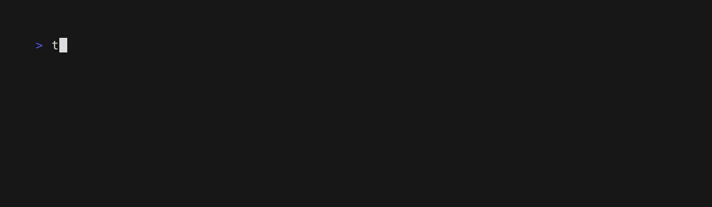

# Terraform Provider Manager

[](https://lbesson.mit-license.org/)

Terraform Provider Manager (`tpm`) is a command-line interface (CLI) tool designed to simplify the management of [Terraform](https://www.terraform.io/) providers in the [plugin cache directory](https://developer.hashicorp.com/terraform/cli/config/config-file#provider-plugin-cache). With `tpm` you can easily **install, uninstall, and list providers**, helping you to streamline your Terraform workflow.

One of the key benefits of `tpm` is that it **does not require Terraform to be installed**, making it a lightweight and efficient tool for managing your cached providers.


<p align="center">
  <a href="#installation">Installation</a> •
  <a href="#usage">Usage</a> •
  <a href="#useful-links">Useful Links</a> •
  <a href="#license">License</a>
</p>

## Installation

### GNU/Linux

Arch Linux users from [AUR](https://aur.archlinux.org/packages/terraform-tpm-bin) (maintained by [@jonathanio](https://github.com/jonathanio)):

```shell
yay -S terraform-tpm-bin
```

### From releases

Stable binaries for all platforms are available on the [releases page](https://github.com/Madh93/tpm/releases). To install, download the binary for your platform from "Assets", extract the downloaded file and place `tpm` into your `PATH`:

```shell
curl -L https://github.com/Madh93/tpm/releases/latest/download/tpm_$(uname -s)_$(uname -m).tar.gz | tar -xz -O tpm > /usr/local/bin/tpm
chmod +x /usr/local/bin/tpm
```

### Go

If you have Go installed:

```shell
go install github.com/Madh93/tpm@latest
```

### From source

Install Go if it is not already installed. You can download it from the official [website](https://golang.org/dl).

Clone the Terraform Provider Manager repository to build and install the binary:

```shell
git clone https://github.com/Madh93/tpm && cd tpm && make install
```

## Usage

```shell
Terraform Provider Manager is a simple CLI to manage Terraform providers in the Terraform plugin cache directory

Usage:
  tpm [flags]
  tpm [command]

Available Commands:
  completion  Generate the autocompletion script for the specified shell
  help        Help about any command
  install     Install a provider
  list        List all installed providers
  purge       Purge all installed providers
  uninstall   Uninstall a provider

Flags:
  -c, --config string                       config file for tpm
  -d, --debug                               enable debug mode
  -h, --help                                help for tpm
  -p, --terraform-plugin-cache-dir string   the location of the Terraform plugin cache directory (default "/home/user/.terraform.d/plugin-cache")
  -r, --terraform-registry string           the Terraform registry provider hostname (default "registry.terraform.io")
  -v, --version                             version for tpm

Use "tpm [command] --help" for more information about a command.
```

### Install a provider

To install a provider you only need to provide the name. Optionally, you can specify a version by using `<package>@<version>`. By default, if no version is specified, the latest avaiable version, also known as `@latest`, will be installed.

You can also specify the architecture and operating system. If not specified, the information from the system where tpm is being executed will be used.



In addition, it's possible to install multiple providers at once specifying a `providers.yml` file, making it easier to share and reuse installation requirements. For example:

```yaml
providers:
  - name: hashicorp/aws@3.64.0
  - name: hashicorp/random
    os:
      - linux
      - darwin
    arch:
      - amd64
      - arm64
```


### List installed providers

This will display on the screen the installed providers. Optionally, you can specify an output format. Valid output formats are:

- `text` (default)
- `json`
- `csv`
- `table`


### Uninstall a provider

Uninstalling a provider is exactly the same as installing it. You can specify both the version, operating system, and architecture.


### Purge all providers

This will delete all installed providers from the current registry.


## Useful Links

- [Terraform](https://www.terraform.io/)
- [Terraform Registry](https://registry.terraform.io/)
- [Terraform Providers Docs](https://developer.hashicorp.com/terraform/language/providers)
- [Terraform Provider Plugin Cache Docs](https://developer.hashicorp.com/terraform/cli/config/config-file#provider-plugin-cache)
- [Terraform plugin caching](https://www.scalefactory.com/blog/2021/02/25/terraform-plugin-caching/)
- [How to Speed Up Terraform in CI/CD Pipelines](https://infinitelambda.com/speed-up-terraform-cicd-pipeline/)

## License

This project is licensed under the [MIT license](LICENSE).
